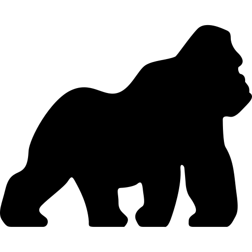

## Monkey Kong In C++   
Monkey is a programming language built by reading through Writing An Interpreter In Go in C++.

Monkey is implemented as a tree-walking interpreter.

Here is what Monkey looks like:

```c++
// Integers & arithmetic expressions...
let version = 1 + (50 / 2) - (8 * 3);

// ... and strings
let name = "The Monkey programming language";

// ... booleans
let isMonkeyFastNow = true;

// ... arrays & hash maps
let people = [{"name": "Anna", "age": 24}, {"name": "Bob", "age": 99}];
```

It also has functions!

```c++
// User-defined functions...
let getName = fn(person) { person["name"]; };
getName(people[0]); // => "Anna"
getName(people[1]); // => "Bob"

// and built-in functions
puts(len(people))  // prints: 2
```

And it has conditionals, implicit and explicit returns and recursive functions, which means we can do this in Monkey:

```c++
let fibonacci = fn(x) {
  if (x == 0) {
    0
  } else {
    if (x == 1) {
      return 1;
    } else {
      fibonacci(x - 1) + fibonacci(x - 2);
    }
  }
};
```

But the crown jewel in every Monkey implementation are closures:

```c++
// `newAdder` returns a closure that makes use of the free variables `a` and `b`:
let newAdder = fn(a, b) {
    fn(c) { a + b + c };
};
// This constructs a new `adder` function:
let adder = newAdder(1, 2);

adder(8); // => 11
```

## Monkey list of features

* C-like syntax
* Variable bindings
* Integers and Booleans
* Arithmetic Expressions
* Built-in functions
* First-class and higher-order functions
* Closures
* String data structure
* Array data structure
* Hash data structure

*Code snippets on how to use the about features can be found above and in qa/test.cpp*

## Worth mentioning
* For the interpreter's needs, an Arena Pool implementation is used to collect and handle the garbage.

  The arena, does not delete the unused objects. Instead, it marks them as down as unused, for future use.
  
  The marking is done by holding a simple reference counter on each object that states how many entities use it.
  
  If the counter is 0, the object can be marked as unused.
  

## How to install
The project contains two executables:
* the REPL.
* A Quality Assurance (qa/) mechanism for the project.

 You can compile the project using the CMAKE cross-platform software tool.
 
__REPL compilation__
* cd on the project's root directory
* mkdir build/
* cmake ..
* make
An executable will be created in the build/ directory

__QA mechanism compilation__
* cd on the qa/ directory
* follow the previous steps


## Authors

    George Kontogiannis - Initial work

## License

This project is licensed under the MIT License - see the LICENSE.md file for details

## Acknowledgments
    Inspired by the book 'Writing an interpreter in Go" by Thorsten Ball
